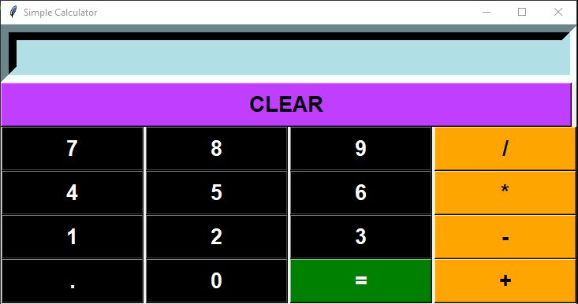

# Simple Python Calculator:

Name: PATHIPAKA GANESH
Company: CODTECH IT SOLUTIONS
ID: CT08WD497
Domain: PYTHON PROGRAMMING
Duration: 20 MAY TO 20 JUNE 2024
Mentor: SRAVANI GOUNI

**Overview of the Project**

This is a simple calculator application built using Python 3 and Tkinter for the GUI.

**Requirements:**
Python 3.x
Tkinter (comes pre-installed with Python)
Setup
**Ensure Python is installed:**

Download and install Python from python.org.
Verify Tkinter installation:

Tkinter is included with Python. You can verify it by running the following command in your Python environment:
bash
Copy code

python -m tkinter

If a window appears, Tkinter is installed correctly.

**Download the calculator script:**

Save the provided code into a file named calculator.py.
Run the calculator:

Open a terminal or command prompt.
Navigate to the directory where calculator.py is saved.
Run the script using the following command:
bash
Copy code

python3 calculator.py

**How It Works**

GUI Interface: The calculator interface is created using Tkinter.
Input Field: Displays the current expression.
Buttons: Includes buttons for digits (0-9), operations (+, -, *, /), decimal point, clear (C), and equals (=).
Click Handling: When a button is clicked, the corresponding value is appended to the expression displayed in the input field.
Clear Functionality: The clear button (C) resets the input field and expression.
Evaluation: When the equals button (=) is clicked, the expression is evaluated, and the result is displayed. If the expression is invalid, an error message is shown.
The calculator supports basic arithmetic operations and can handle simple expressions.

## GUI Image

